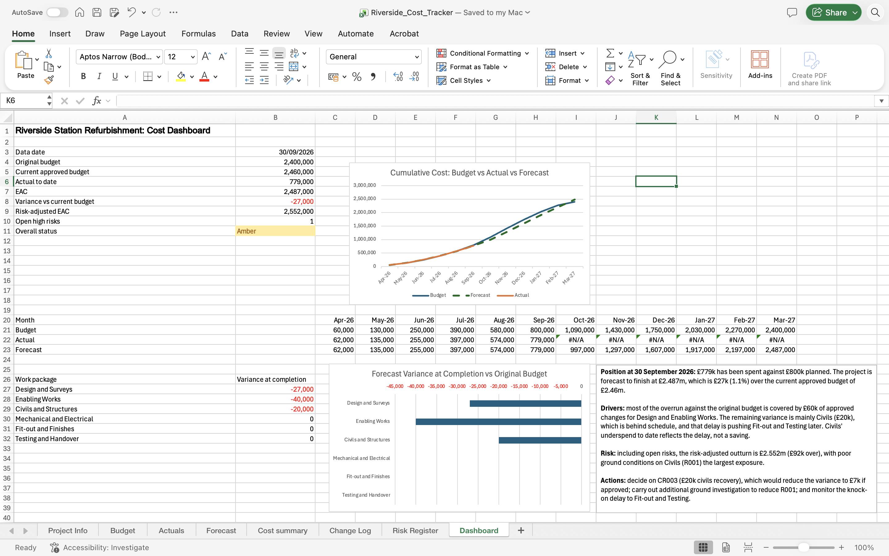

# Riverside Station Refurbishment – Project Cost Tracker

A monthly cost control model built in Excel for a fictional £2.4m, 12-month rail station refurbishment (Apr 2026 – Mar 2027), reported at a data date of 30 September 2026.

## What it does
Tracks budget, actual cost and forecast across six work packages to calculate the Estimate at Completion (EAC) and variance, with change control, a risk register and a one-page dashboard.

## Sheets
- **Project Info** – project details and the data date (a named cell that drives the whole model)
- **Budget** – the fixed baseline, phased by month, with a cumulative S-curve row
- **Actuals** – monthly actual costs up to the data date
- **Forecast** – remaining forecast (inputs in yellow) combined with actuals to give EAC
- **Cost Summary** – budget vs actual to date, EAC, variance at completion and RAG status per work package
- **Change Log** – approved and proposed changes, separating scope change from true overrun
- **Risk Register** – likelihood × impact scoring and probability-weighted cost exposure
- **Dashboard** – key figures, S-curve, variance chart and written commentary

## Key findings (at 30 Sep 2026)
- Forecast outturn £2.487m: £27k (1.1%) over the current approved budget of £2.46m.
- £60k of the £87k overrun against the original budget is approved scope change; the remaining variance is mainly Civils, which is behind schedule.
- Risk-adjusted outturn £2.552m, with ground conditions on Civils the largest open risk.

## Monthly update process
1. Move the data date forward on Project Info.
2. Enter the month's actual costs on Actuals.
3. Update the remaining forecast (yellow cells) on Forecast.
4. Confirm every control check shows 0.

## Excel features used
SUMIF/SUMIFS, XLOOKUP, IF, COUNTIFS, EDATE, named ranges, data validation, conditional formatting, line and bar charts.
